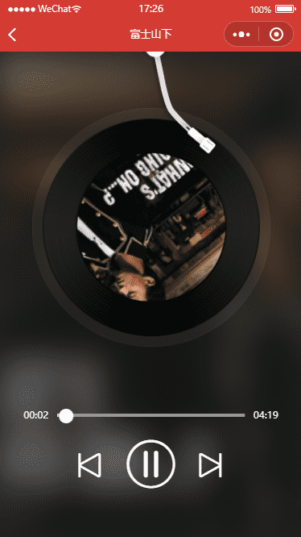

# 云音乐

## 项目描述

本项目使用微信小程序云进行开发。项目主要包括：歌单列表、音乐列表、音乐播放、歌词展示、发现列表、发布博客、评论博客、博客详情、个人主页等。

## 使用插件/模块

+ [tcb-router](https://github.com/TencentCloudBase/tcb-router)：小程序·云开发 云函数类 koa 路由工具
+ [request](https://github.com/request/request)、[request-promise](https://github.com/request/request-promise)

## 基础知识

+ 小程序渲染层与逻辑层
  
+ `setData`：用于数据从逻辑层发送到视图层(异步)，同时改变对应的 this.data 的值(同步)
  + 避免`setData`的数据多大,最大设置值不能超过1M
  + 避免`setData`的调用过于频繁
  + 避免将未绑定在WXML的变量传入`setData`
+ 场景值scene的作用：用来描述用户进入小程序的路径
+ 小程序性能与体验优化
  + 合理设置可点击元素的响应区域大小
  + 避免渲染页面耗时过长
  + 避免执行脚本耗时过长
  + 对网络请求做必要的缓存以避免多余的请求
  + 不要引入未被使用的WXSS样式
  + 文字颜色与背景搭配较好，适宜的颜色对比度更方便用户阅读
  + 所有资源请求建议使用`HTTPS`
  + 不使用废弃接口
  + 避免过大的WXML节点数目：一个页面`少于1000个`WXML节点、节点树深度`少于30层`、子节点树`不大于60个`
  + 避免将不可能被访问的页面打包在小程序里
  + 及时回收定时器
  + 避免使用`:active伪类`来实现点击态
  + 滚动区域可开启惯性滚动以增强体验：iso --- `-webkit-overflow-scrolling: touch`
  + 避免出现任何JavaScript异常
  + 避免短时间内发起太多的图片请求
  + 所有请求应响应正常，避免短时间发起太多请求，所有请求的耗时不应太久

## 项目展示

